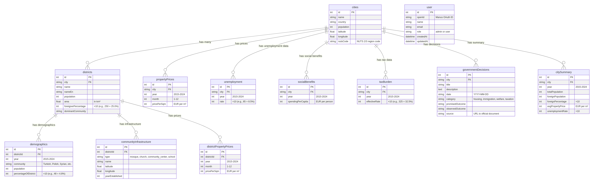

# UrbanPulse - Детальное Техническое Задание

**Дата:** 27 декабря 2025  
**Версия:** 2.0  
**Статус:** Ожидает решения по naming

---

## 1. Обзор Проекта

**UrbanPulse** - исследовательская платформа для анализа корреляций между демографическими изменениями и динамикой рынка недвижимости в 15 крупных городах Европы и Северной Америки за период 2015-2024 гг.

### Ключевые Принципы
- ✅ **Нейтральность** - никаких политических обвинений
- ✅ **Прозрачность** - полное раскрытие источников и ограничений данных
- ✅ **Академичность** - корреляции, не каузальность
- ✅ **Юридическая защита** - GDPR compliance, Terms, Privacy Policy

---

## 2. Архитектура Базы Данных

### 2.1 Визуализация Схемы



### 2.2 Основные Таблицы

#### `cities` - Города (15 записей)
| Поле | Тип | Описание |
|------|-----|----------|
| id | INT PK | Уникальный идентификатор |
| name | VARCHAR(100) | Название города |
| country | VARCHAR(100) | Страна |
| population | INT | Население |
| latitude | DECIMAL(10,8) | Широта |
| longitude | DECIMAL(11,8) | Долгота |
| nutsCode | VARCHAR(10) | NUTS 2/3 код региона |

**Города:**
1. Berlin (Germany)
2. Munich (Germany)
3. Hamburg (Germany)
4. Cologne (Germany)
5. Paris (France)
6. Vienna (Austria)
7. Rome (Italy)
8. Amsterdam (Netherlands)
9. Brussels (Belgium)
10. London (United Kingdom)
11. Washington D.C. (United States)
12. New York (United States)
13. Toronto (Canada)
14. Los Angeles (United States)
15. Chicago (United States)

#### `districts` - Районы (~120 записей)
| Поле | Тип | Описание |
|------|-----|----------|
| id | INT PK | Уникальный идентификатор |
| city | VARCHAR(100) FK | Город |
| name | VARCHAR(200) | Название (оригинал) |
| nameEn | VARCHAR(200) | Название (англ.) |
| population | INT | Население |
| area | DECIMAL(10,2) | Площадь (км²) |
| foreignerPercentage | INT | % иностранцев ×10 (250 = 25.0%) |
| dominantCommunity | VARCHAR(100) | Доминирующая община |

#### `demographics` - Демография (~6000 записей)
| Поле | Тип | Описание |
|------|-----|----------|
| id | INT PK | Уникальный идентификатор |
| districtId | INT FK | ID района |
| year | INT | Год (2015-2024) |
| community | VARCHAR(100) | Община (Turkish, Polish, Syrian...) |
| population | INT | Население общины |
| percentageOfDistrict | INT | % от района ×10 (48 = 4.8%) |

**Отслеживаемые общины:**
- Turkish
- Polish
- Syrian
- Afghan
- Italian
- Greek
- Croatian
- Russian
- Romanian
- Bulgarian

#### `propertyPrices` - Цены на недвижимость (~1800 записей)
| Поле | Тип | Описание |
|------|-----|----------|
| id | INT PK | Уникальный идентификатор |
| city | VARCHAR(100) FK | Город |
| year | INT | Год (2015-2024) |
| month | INT | Месяц (1-12) |
| pricePerSqm | INT | EUR за м² |

#### `unemployment` - Безработица (150 записей)
| Поле | Тип | Описание |
|------|-----|----------|
| id | INT PK | Уникальный идентификатор |
| city | VARCHAR(100) FK | Город |
| year | INT | Год (2015-2024) |
| rate | INT | Уровень ×10 (85 = 8.5%) |

**⚠️ ВАЖНО:** Это NUTS 2 региональные данные, не city-level!

#### `socialBenefits` - Социальные расходы (150 записей)
| Поле | Тип | Описание |
|------|-----|----------|
| id | INT PK | Уникальный идентификатор |
| city | VARCHAR(100) FK | Город |
| year | INT | Год (2015-2024) |
| spendingPerCapita | INT | EUR на человека |

#### `taxBurden` - Налоговая нагрузка (150 записей)
| Поле | Тип | Описание |
|------|-----|----------|
| id | INT PK | Уникальный идентификатор |
| city | VARCHAR(100) FK | Город |
| year | INT | Год (2015-2024) |
| effectiveRate | INT | Эффективная ставка ×10 (325 = 32.5%) |

#### `governmentDecisions` - Решения властей (~75 записей)
| Поле | Тип | Описание |
|------|-----|----------|
| id | INT PK | Уникальный идентификатор |
| city | VARCHAR(100) FK | Город |
| title | VARCHAR(500) | Название решения |
| description | TEXT | Описание |
| date | DATE | Дата принятия |
| category | ENUM | housing, immigration, welfare, taxation |
| promisedOutcome | TEXT | Обещанный результат |
| observedOutcome | TEXT | Наблюдаемый результат |
| source | VARCHAR(500) | URL источника |

#### `communityInfrastructure` - Инфраструктура (~600 записей)
| Поле | Тип | Описание |
|------|-----|----------|
| id | INT PK | Уникальный идентификатор |
| districtId | INT FK | ID района |
| type | ENUM | mosque, church, community_center, school |
| name | VARCHAR(200) | Название |
| latitude | DECIMAL(10,8) | Широта |
| longitude | DECIMAL(11,8) | Долгота |
| yearEstablished | INT | Год основания |

---

## 3. Проблема: Naming "Urban Development Observatory"

### 3.1 Текущее Состояние

**Локация:** Homepage (Home.tsx, строки 187-191)

```tsx
<h3 className="text-2xl font-bold text-white mb-2">
  Urban Development Observatory
</h3>
<p className="text-gray-300 text-sm">
  Analyzing correlations between demographic change, city context, 
  and housing market dynamics. Explore distributional effects across 
  employment, economic indicators, and urban development patterns.
</p>
```

### 3.2 Проблема

**"Observatory"** (обсерватория) имеет коннотацию **surveillance/monitoring** (наблюдение/слежка), что может восприниматься как:
- Мониторинг действий правительства
- Политический watchdog
- Критика властей

Это противоречит нейтральной академической позиции платформы.

### 3.3 Альтернативные Варианты

#### Вариант 1: **City Data Explorer** ✅ РЕКОМЕНДУЕТСЯ
**Преимущества:**
- Простой, описательный
- Нет политического подтекста
- Фокус на исследовании данных, не на наблюдении

**Текст:**
```
City Data Explorer
Explore correlations between demographic change and housing market dynamics 
across 15 cities. Analyze distributional effects in employment, economic 
indicators, and urban development patterns.
```

---

#### Вариант 2: **Urban Trends Dashboard**
**Преимущества:**
- Технический, нейтральный
- Подчеркивает data visualization
- Без surveillance-коннотации

**Текст:**
```
Urban Trends Dashboard
Track demographic and housing market trends across 15 global cities. 
Visualize correlations in employment, economic indicators, and 
urban development patterns (2015-2024).
```

---

#### Вариант 3: **Demographic & Housing Analytics**
**Преимущества:**
- Прямое описание функции
- Академический тон
- Максимально нейтрально

**Текст:**
```
Demographic & Housing Analytics
Analyze correlations between population composition and property market 
dynamics. Explore distributional effects across employment, economic 
indicators, and city development patterns.
```

---

#### Вариант 4: **City Comparison Tool**
**Преимущества:**
- Функциональный, не политический
- Подчеркивает сравнительный анализ
- Простой для понимания

**Текст:**
```
City Comparison Tool
Compare demographic composition and housing market indicators across 
15 cities. Analyze correlations in employment, economic trends, and 
urban development patterns (2015-2024).
```

---

#### Вариант 5: **Urban Research Hub**
**Преимущества:**
- Академический, без surveillance
- Подчеркивает исследовательскую цель
- Нейтральный тон

**Текст:**
```
Urban Research Hub
Research platform for analyzing correlations between demographic change 
and housing markets. Explore distributional effects across employment, 
economic indicators, and urban development patterns.
```

---

### 3.4 Сравнительная Таблица

| Вариант | Нейтральность | Академичность | Понятность | Риск Surveillance | Рекомендация |
|---------|---------------|---------------|------------|-------------------|--------------|
| **City Data Explorer** | ⭐⭐⭐⭐⭐ | ⭐⭐⭐⭐ | ⭐⭐⭐⭐⭐ | ❌ Нет | ✅ **#1** |
| **Urban Trends Dashboard** | ⭐⭐⭐⭐⭐ | ⭐⭐⭐ | ⭐⭐⭐⭐ | ❌ Нет | ✅ **#2** |
| **Demographic & Housing Analytics** | ⭐⭐⭐⭐⭐ | ⭐⭐⭐⭐⭐ | ⭐⭐⭐ | ❌ Нет | ⭐ Хорошо |
| **City Comparison Tool** | ⭐⭐⭐⭐ | ⭐⭐⭐ | ⭐⭐⭐⭐⭐ | ❌ Нет | ⭐ Хорошо |
| **Urban Research Hub** | ⭐⭐⭐⭐ | ⭐⭐⭐⭐⭐ | ⭐⭐⭐ | ❌ Нет | ⭐ Хорошо |
| **Urban Development Observatory** (текущий) | ⭐⭐ | ⭐⭐⭐⭐ | ⭐⭐⭐⭐ | ⚠️ **ДА** | ❌ Заменить |

---

## 4. Технический Стек

### 4.1 Frontend
- **React 19** - UI framework
- **Tailwind CSS 4** - Styling
- **shadcn/ui** - Component library
- **Wouter** - Routing
- **tRPC 11** - Type-safe API
- **Recharts** - Data visualization

### 4.2 Backend
- **Node.js 22** - Runtime
- **Express 4** - HTTP server
- **tRPC 11** - API layer
- **Drizzle ORM** - Database ORM
- **MySQL/TiDB** - Database

### 4.3 Инфраструктура
- **Manus Hosting** - Built-in hosting
- **Manus OAuth** - Authentication
- **Manus Analytics** - Usage tracking
- **S3 Storage** - File storage (если нужно)

---

## 5. Ключевые Страницы

### 5.1 Homepage (`/`)
- Hero section с логотипом
- "Compare 15 Cities (2015–2024)"
- Cookie consent banner (GDPR)
- **🔴 ПРОБЛЕМА:** "Urban Development Observatory" section

### 5.2 Methodology (`/methodology`)
- Data sources (Eurostat, Destatis, INSEE...)
- "Correlation ≠ Causation" disclaimer
- Alternative hypotheses
- Data limitations
- NUTS mapping reference

### 5.3 Government Impact (`/government`)
- Regional labour market indicator (NUTS 2)
- Social benefits spending
- Tax burden
- Policy decisions timeline
- **Data quality indicators** (🟢🟡🔴)

### 5.4 About (`/about`)
- Principal Investigator (Sky-Mind Research Team)
- **⚠️ CRITICAL:** "Not peer-reviewed" disclosure
- Funding sources (self-funded)
- Conflicts of interest (none)
- Contact: info@sky-mind.com

### 5.5 Legal Pages
- **Terms of Service** (`/terms`) - Prohibited uses, liability
- **Privacy Policy** (`/privacy`) - GDPR compliant
- **References** (`/references`) - Full bibliography with citations

---

## 6. Юридическая Защита

### 6.1 Реализованные Меры
✅ "Correlation ≠ Causation" disclaimers  
✅ GDPR cookie consent banner  
✅ Terms of Service  
✅ Privacy Policy (GDPR compliant)  
✅ "Not peer-reviewed" disclosure  
✅ Data source labels (Eurostat, Government Records)  
✅ NUTS mapping transparency  
✅ Interpretation toggle (off by default)  

### 6.2 Критические Дисклеймеры

**На каждой странице:**
> "Research & Educational Tool. Correlation does not imply causation."

**В Methodology:**
> "Where city-level data is unavailable, regional (NUTS 2/3) or national indicators are used as contextual proxies."

**В About:**
> "This platform has not undergone formal peer review."

---

## 7. Статус Данных

### 7.1 Временное Покрытие
- **Demographics:** 2015-2024 ✅
- **Property Prices:** 2015-2024 ✅
- **Unemployment:** 2015-2024 ✅ (недавно расширено)
- **Social Benefits:** 2015-2024 ✅ (недавно расширено)
- **Tax Burden:** 2015-2024 ✅ (недавно расширено)

### 7.2 Качество Данных
- 🟢 **High** - Official city-level statistics
- 🟡 **Medium** - NUTS 2/3 regional proxies
- 🔴 **Low** - Model-based estimates / Statistical interpolation

### 7.3 Источники
- **Eurostat** - Demographics (urb_cpopcb), Unemployment (lfst_r_lfu3rt)
- **Destatis** - German national statistics
- **INSEE** - French national statistics
- **ONS** - UK national statistics
- **OpenStreetMap** - Infrastructure locations
- **Government Records** - Policy decisions

---

## 8. Следующие Шаги

### 8.1 КРИТИЧНО - Требует Решения
1. **Выбрать название** для "Urban Development Observatory" section
2. **Обновить VITE_APP_TITLE** в Settings → Secrets UI (с "Berlin Real Estate Analytics" на "UrbanPulse")

### 8.2 Рекомендуемые Улучшения
3. Создать FAQ страницу
4. Добавить "Export Chart" функцию с watermark
5. Добавить "Last Updated" timestamps на графики
6. Реализовать "Compare Years" функцию (2015 vs 2024 side-by-side)

---

## 9. Контакты

**Владелец:** Sky-Mind  
**Email:** info@sky-mind.com  
**Website:** sky-mind.com  
**Проект:** UrbanPulse

---

## 10. Приложения

### A. Database Schema Diagram
См. `DATABASE_SCHEMA.png`

### B. NUTS Mapping Reference
См. `NUTS_MAPPING_REFERENCE.md`

### C. Expert Audit Report
См. `EXPERT_AUDIT_REPORT.md`

### D. Data Import Schema
См. `DATA_IMPORT_SCHEMA.md`

### E. Eurostat Dataset Codes
См. `EUROSTAT_DATASET_CODES.md`

---

**Конец Технического Задания**
